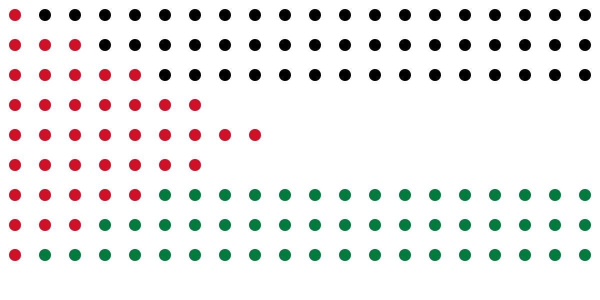

<h1 align="center">Khader A. Murtaja</h1>

  
   
  
  
  
  
  
  

🚀 I build delightful, performant mobile experiences with Flutter, powered by Firebase, Practical Flutter Architecture (PFA) and Clean Architecture. I care about elegant UI, resilient state management, and maintainable codebases.

 

<!-- Palestine flag (dot matrix) -->

<h2 align="center">End the genocide in Gaza — Free Palestine.</h2>

## 🧭 About Me

- 🔭 Currently focused on: Flutter, Dart, Firebase
- 🌱 Learning next: System Design.
- 💡 Interests: System Design.
- 🤝 Open to: Collaborations, mentoring, speaking, and freelance opportunities
- ⚡ Fun fact: I'm always hungry
  

## 🧰 Tech Stack

  <!-- Core Technologies -->
  
  
  
  

  <!-- State Management & Architecture -->
  
  
  
  

  <!-- Platform & Features -->
  
  
  
  
  
  
  
  

  <!-- DevOps & Quality -->
  
  
  
  
  

  <!-- Engineering Practices -->
  
  
  
  

## 🗂️ Table of Contents

- [About Me](#-about-me)
- [Tech Stack](#-tech-stack)
- [Professional Summary](#-professional-summary)
- [Highlights](#-highlights)
- [Professional Experience](#-professional-experience)
- [Education](#-education)
- [Skills](#-skills)
- [Certifications](#-certifications)
- [Volunteer](#-volunteer)
- [Publications](#-publications)
- [GitHub Stats](#-github-stats)
- [Trophies](#-trophies)
- [Connect](#-connect)

## 💼 Professional Summary

Seasoned Senior Flutter Engineer with 4+ years building scalable, high-performance mobile apps using Flutter and Dart. Proven track record leading MVPs from scratch, architecting clean systems with BLoC, and integrating advanced features such as real-time messaging, push notifications, and multi-language support across projects like Enfaq, Prosway, and The Social App. Experienced in upgrading codebases for compatibility and efficiency, implementing secure authentication (incl. 2FA), and ensuring cross-platform stability on iOS and Android. Passionate about Firebase, REST APIs, and agile execution to ship innovative solutions and exceptional user experiences.

## ✨ Highlights

- 📱 End-to-end Flutter app development: ideation → release (iOS/Android)
- 🔐 Auth, realtime sync, and cloud storage with Firebase
- 🧪 Unit, widget, and integration testing for reliability
- 🚀 Performance-focused UI with animations and responsive layouts
- 🧩 Modular, maintainable codebases using Clean Architecture principles

## 💼 Professional Experience

### [Enfaq](https://enfaq.com.sa/en/) — Senior Flutter Engineer (Remote · Riyadh, Saudi Arabia) · Apr 2025 – Jul 2025
- Led MVP mobile app development from the ground up with Flutter/Dart following best practices
- Architected and implemented Practical Flutter Architecture for clarity, scalability, and maintainability
- Customized and enhanced UI components aligned to evolving use cases and UX best practices
- Integrated backend services using OpenAPI for seamless microservices access
- Set up Firebase project and push notifications for reliable, real-time engagement
- Maintained iOS/Android builds ensuring stability, compatibility, and OS-compliance

### [Prosway](https://prosway.com/) — Senior Flutter Engineer (Remote · Memphis, TN, USA) · Aug 2024 – Apr 2025
- Built real estate marketplace app from scratch with Clean Architecture and BLoC
- Implemented real-time messaging (1:1/group, text/images) via Firebase Realtime Database
- Developed notifications (push/in-app) with FCM and user preferences for reliable delivery
- Implemented authentication with email/password and social logins (Apple, Google) and secure token mgmt
- Added Two-Factor Authentication (OTP) to strengthen account security
- Enhanced property analysis with interactive charts for trends and investment metrics
- Wrote unit/widget tests for core flows (routing, splash, analysis) with Flutter test, Mockito, Mocktail

### [UMRA Tech](https://www.umratech.com) — Flutter Engineer (Remote · Washington, D.C., USA) · Dec 2022 – Sep 2024
- Built favorites management for duas and robust backup for [Everyday Muslim](https://apps.apple.com/il/app/everyday-muslim-ramadan-2024/id1546578729) app
- Updated Firebase collections to match codebase changes for [Deenify](https://apps.apple.com/il/app/deenify-muslim-community-app/id1538524619) and [Everyday Muslim](https://apps.apple.com/il/app/everyday-muslim-ramadan-2024/id1546578729)
- Upgraded [Deenify](https://apps.apple.com/il/app/deenify-muslim-community-app/id1538524619) to latest Flutter/Dart; ensured non-nullability and optimized packages/performance
- Upgraded [Islamic - Trivia](https://apps.apple.com/il/app/islamic-trivia/id1575106691) app to latest versions; reduced runtime errors and improved performance

### [The Social App](https://apps.apple.com/il/app/the-social-app-make-paid-chat/id1519595567) — Flutter Engineer (Remote · Washington, D.C., USA) · Sep 2021 – Jun 2023
- Built Paid Group Chat UI/logic with VanityLinks to boost personalization and engagement
- Enhanced large WhatsApp chat import, streamlined flow for seamless UX
- Implemented localization for 16 languages to expand global reach
- Upgraded native code for Android 12+ notifications with inline reply
- Improved voice notes (playback speed, audio quality)
- Built onboarding ShowCase Tutorial to lift activation
- Optimized version control and delivery workflows
- Performance improvements adhering to Flutter best practices

### [Klokbox](https://klokbox.com) — Flutter Engineer (Remote · Killarney, Ireland) · Jun 2021 – Aug 2021
- Migrated to Null Safety; enforced non-nullability to reduce runtime errors
- Resolved UI issues to meet design guidelines and improve usability
- Re-analyzed UI elements to improve interaction and satisfaction

## 🎓 Education

[Al-Azhar University](https://www.alazhar.edu.ps/eng/) — Gaza, Palestine
Bachelor of Software Engineering · Sep 2014 – Present

- Strong foundation in software design, programming, data structures, algorithms, and SDLC

## 🛠️ Skills

Flutter · Dart · Git · GitFlow · GitHub · Version Control · Mobile Application Development · REST APIs · Firebase · State Management · Push Notifications · Clean Architecture · Agile · MVVM · WebSocket · In-App Purchase · Google Pay · Apple Pay · Google Play · Apple Store · TestFlight · OOP · Performance Optimization · CI/CD (CodeMagic) · Code Review · Teamwork · Continuous Improvement · Communication · Attention to Detail · Problem Solving · Requirements Analysis

## 📜 Certifications

- [Introduction to AWS](https://verify.acloud.guru/4C4FFC6C4E94) — A Cloud Guru | Pluralsight · Oct 05, 2023 · Credential ID: 4C4FFC6C4E94
- [Introduction to Cloud Computing](https://verify.acloud.guru/CEA01C72DD1D) — A Cloud Guru | Pluralsight · Jul 24, 2023 · Credential ID: CEA01C72DD1D

## 🤝 Volunteer

[Gaza Sky Geeks](https://gazaskygeeks.com) — Gaza Strip — Code Mentor · Jul 2018 – Dec 2018
- Supported the local tech ecosystem via Gaza’s first startup accelerator; helped launch and grow startups
- Taught HTML, CSS, JS fundamentals; prepared lesson plans and delivered engaging sessions
- Mentored students to overcome challenges and improve coding skills
- Organized community workshops to promote tech literacy and engagement

## ✍️ Publications

- [Manage the State via ChangeNotifier and ListenableBuilder](https://medium.com/@khadermurtaja1/manage-the-state-via-changenotifier-and-listenablebuilder-ed181de67ad8) — Medium — May 21, 2024

## 📊 GitHub Stats

  
  

  

  

  

  

## 🏆 Trophies

 
  

## 🐍 Contribution Snake

  

---

  Made with ❤️ by Khader Murtaja · If you like my work, consider giving a ⭐ to my repositories!

